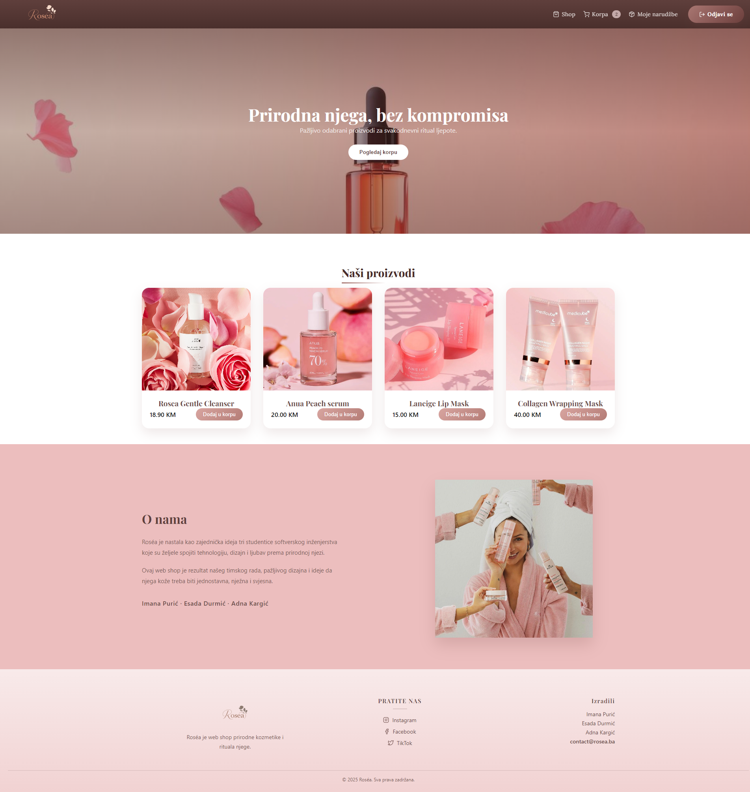

# ROSÉA - Online Shop za kozmetiku i higijenu

Roséa je web aplikacija razvijena u okviru predmeta Web programiranje. Omogućava pregled proizvoda, upravljanje korpom, autentifikaciju korisnika i osnovne operacije naručivanja. Aplikacija podržava različite uloge korisnika, gdje admin ima pristup dashboard-u sa CRUD operacijama i uvidom u sve narudžbe, dok obični korisnici mogu pregledati proizvode, upravljati korpom i pratiti svoje narudžbe.

## Tehnologije i arhitektura

Aplikacija je podijeljena na dva dijela:
- **Frontend** – korisničko sučelje (web shop)
- **Backend** – REST API servis koji podržava poslovnu logiku i pristup podacima

### Frontend
Frontend je razvijen korištenjem **React-a**, HTML5 i CSS3, uz JavaScript za logiku i interakciju. Komunikacija s backendom odvija se putem **Fetch API**, dok se lokalni podaci pohranjuju u **localStorage**. Navigacija između stranica se ostvaruje korištenjem **React Router-a**.

**Funkcionalnosti frontenda po ulozi:**

**Korisnička uloga (USER):**
- Registracija i prijava korisnika
- Pregled liste proizvoda i pojedinačnih detalja
- Upravljanje korpom (dodavanje i uklanjanje proizvoda)
- Simulacija checkout-a i slanje narudžbi
- Pregled svojih narudžbi i statusa svake narudžbe




**Administratorska uloga (ADMIN):**
- Pristup dashboard-u za administraciju
- CRUD operacije nad proizvodima
- Upravljanje kategorijama proizvoda
- Pregled svih narudžbi korisnika
- Ažuriranje statusa narudžbi
- Praćenje i kontrola stanja baze u skladu s akcijama korisnika


### Backend
Backend je razvijen koristeći **Node.js** i **Express.js** te implementira REST API sa GET, POST, PUT i DELETE metodama.  
**Osnovne rute backend-a:**
- `/api/auth` – autentifikacija i registracija korisnika
- `/api/kategorije` – upravljanje kategorijama
- `/api/proizvodi` – upravljanje proizvodima
- `/api/narudzbe` – upravljanje narudžbama
- `/api/test` – testna ruta backend-a

### Baza podataka
Aplikacija koristi **MySQL relacionu bazu podataka** sa sljedećim entitetima:
- `korisnici` – osnovni podaci o korisniku, lozinka i uloga
- `proizvodi` – detalji o proizvodu (naziv, opis, cijena, slike)
- `narudžbe` – osnovne informacije i status narudžbe
- `stavke_narudžbe` – detalji o količini pojedinačnih proizvoda u narudžbi
- `kategorije` – informacije o kategorijama proizvoda

**Veze između tabela:**
- Korisnici ↔ Narudžbe (1:N)
- Narudžbe ↔ Stavke_narudžbe (1:N)
- Proizvodi ↔ Stavke_narudžbe (1:N)
- Narudžbe ↔ Proizvodi (M:N, preko stavki_narudžbe)
- Kategorije ↔ Proizvodi (1:N)

Veze su realizovane putem **MySQL konekcije u Node.js** korištenjem paketa `mysql2`.

## Instalacija i pokretanje

### Backend
```bash
cd backend
npm install
npm run dev
```

### Frontend
```bash
cd frontend
npm install
npm start
```
